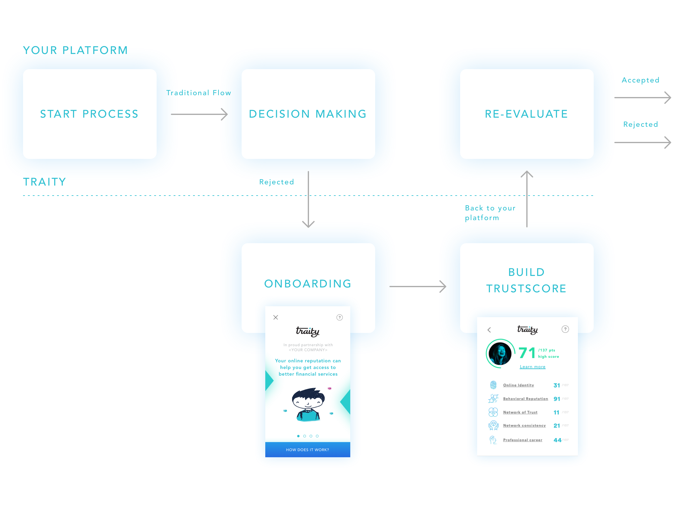
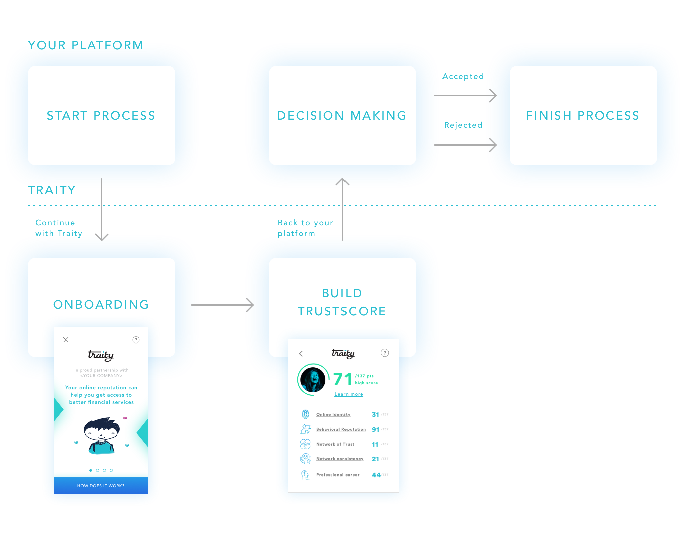

Getting started
===============

Traity Reputation Gateway relies on `REY <https://reputation.network>`_, a decentralized infrastructure for risk scoring based
on Ethereum’s blockchain.
You will need at least one private key to sign the submitted information.
You can learn how to get a new ETH private key `here <https://theethereum.wiki/w/index.php/Accounts,_Addresses,_Public_And_Private_Keys,_And_Tokens#Private_Key>`_.

.. caution::

  It’s very important to keep this private key safe at every moment.

Adding the ReputationGateway to your flow is as easy as redirecting your users to Traity’s onboarding so they can start building their TrustScore. Users should be redirected to one of the following URLs, depending on if you are just testing the platform or do want run actual transactions:

============================================  =======================
============================================  =======================
 https://rg.traity.com/w/<SESSION-TOKEN>      Live environment
 https://rg-dev.traity.com/w/<SESSION-TOKEN>  Development environment
============================================  =======================

The session parameter is a JWT token that contains the necessary information to identify you.
It will also indicate where should users be redirected once they finish the process on Traity.

The JWT token is generated from a payload with the following claims:

======  ====
======  ====
reader  The public address derived from your private key
widget  Hash that contains information about your service,
        including the call back url where users will be redirected.
======  ====

The widget object will require the following fields:

============  ===
============  ===
name          Your company’s name as it will be displayed during the process in Traity
logo          Url of your company’s logo to be displayed during the process in Traity
callback_url  Url where users will be redirect after finishing the process in Traity
============  ===

.. tabs::
  .. tab:: Ruby

    .. literalinclude:: ../snippets/init_session.rb

Having that token, now you can add the link into your website. You can customize it as much as you want.

.. code:: html

  <a href="https://rg.traity.com/eyJ0eXAiOiJKV1QiLCJhbGciOiJub25lIn0.eyJyZWFkZXIiOiIweGU0YmIzRmI0NmU4Mjc1N2Y5RkM2MmMyMjZmYzE4ODJBMkIxMzhkMmUiLCJ3aWRnZXQiOnsibmFtZSI6IlNpbHBoIENvLiIsImxvZ28iOiJodHRwczovL3B1dS5zaC9BRXlCVy9jMTU0YjE2ZDQwLnBuZyIsImNhbGxiYWNrX3VybCI6Imh0dHBzOi8vZXhhbXBsZS5jb20ifX0.">Connect your Online Reputation wit Traity</a>

Now, you just to have to decide in which part of your application’s flow you do you want to include our service. Each business is be different and has its own needs so there might be multiple scenarios to consider:

For example, a user has followed the traditional flow within your app and according to your current scoring system, that person is not eligible for your product. So, you might want to offer them the possibility of using their TrustScore as a complementary data point, increasing your potential customer base from those that were initially rejected.

Also, you could completely substitute your current data collection flow, which might require some sort of manual review, and replace it with our process to have a reliable score that allows you to make decisions in real time.

  Re-engaging with initially rejected customers

  Using Traity as the main scoring system
